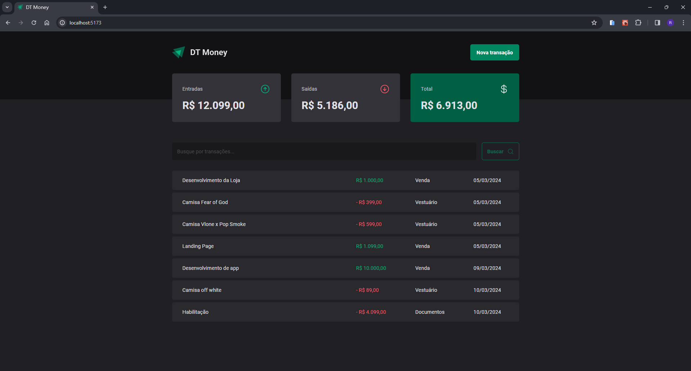

<h1 align="center">
  DT Money 📚
</h1>

<p align="center">
  

  
  
  <a href="https://github.com/RuanCxrdoso/DT-Money/commits/main">
    
  </a>

  

  <a href="https://github.com/RuanCxrdoso/DT-Money/stargazers">
    
  </a>
</p>


<p>
  
</p>

<h4 align="center"> 
	✅ Projeto finalizado ✅
</h4>

<p align="center">
 <a href="#-sobre">Sobre</a> |
 <a href="#-deploy">Deploy</a> |
 <a href="#-como-utilizar">Como utilizar</a> | 
 <a href="#-layout">Layout</a> |
 <a href="#-tecnologias">Tecnologias</a> | 
 <a href="#-autor">Autor</a> | 
 <a href="#-licença">Licença</a>
</p>


## 💻 Sobre

O **DT Money** é um projeto desenvolvido pela `Rocketseat`, como parte da trilha de React do **Ignite**. Ele é um aplicativo projetado para facilitar o gerenciamento de despesas, receitas e débitos. Os usuários podem cadastrar novas entradas, sejam elas receitas ou débitos. Automaticamente, o sistema recalcula um resumo com o total de entradas, o total de saídas e o saldo geral. Além disso, apresenta uma lista detalhada desses gastos, incluindo informações como data de criação. O projeto foi construído utilizando `React` e aplicou os principais fundamentos da biblioteca, como `useContext`, `useCallback`, `useMemo`, entre outros.

**obs**: Devido ao uso do json-server, algumas funções não irão executar corretamente no link do deploy, para um teste real do app sugiro que faça um clone do repo, instale as dependências com seu gerenciador de pacotes, rode o servidor com o script 'dev:server', pegue a url local do json-server e coloque-a na baseURL do axios em src/lib/axios.ts, após isso, em outro terminal, rode o app com o script 'dev' e estará pronto para uso.

Vale ressaltar que este projeto foi desenvolvido como conclusão de um desafio proposto no curso/trilha **Ignite** oferecido pela [Rocketseat](https://www.rocketseat.com.br/).

---

## 🔗 Deploy

O deploy da aplicação pode ser acessado através da seguinte URL: https://dt-money-manager.vercel.app/

---

## 🚀 Como utilizar

### Pré-requisitos

Antes de realizar o download do projeto, é necessário instalar na sua máquina as seguintes ferramentas:

* [Git](https://git-scm.com)
* [NodeJS](https://nodejs.org/en/)
* [NPM](https://www.npmjs.com/)

Além disto é importante uma IDE para manipular o código, como o [VSCode](https://code.visualstudio.com/)

### Clonando e Executando

Passo a passo para clonar e executar a aplicação na sua máquina:

```bash
# Clone este repositório
$ git clone git@github.com:RuanCxrdoso/DT-Money.git

# Acesse a pasta do projeto no terminal
$ cd DT-Money

# Instale as dependências
$ npm install

# Execute a aplicação em modo de desenvolvimento
$ npm run dev

# A aplicação inciará em alguma porta disponível que poderá ser acessada pelo navegador
```

---

## 🎨 Layout

Você pode visualizar o layout do projeto através [desse link](https://www.figma.com/community/file/1138814493269096792). É necessário ter conta no [Figma](https://www.figma.com/) para acessá-lo.

Veja uma demonstração das principais interfaces da aplicação:

### Preview

<p align="center">
  
</p>

---

## 🛠 Tecnologias

As seguintes bibliotecas foram utilizadas no desenvolvimento do projeto:

- **[React.js](https://react.dev/)**
- **[TypeScript](https://www.typescriptlang.org/)**
- **[Vite.js](https://vitejs.dev/)**
- **[React Hook Form](https://react-hook-form.com/)**
- **[Styled-Components](https://styled-components.com/)**
- **[Zod](https://zod.dev/)**
- **[Axios](https://axios-http.com/ptbr/)**
- **[Radix UI](https://www.radix-ui.com/)**


> Para mais detalhes das libs aplicadas no projeto cheque o arquivo [package.json](./package.json)

---

## ✍ Autor


[](https://www.linkedin.com/in/ruancardosolinkdin/)

[](mailto:cardosoruan2001@gmail.com)

---

## 📝 Licença

Este projeto está sob a licença MIT. Consulte o arquivo [LICENSE](./LICENSE) para mais informações

Feito com 💛 por Ruan 👋🏽 [Entre em contato!](https://www.linkedin.com/in/ruancardosolinkdin/)
