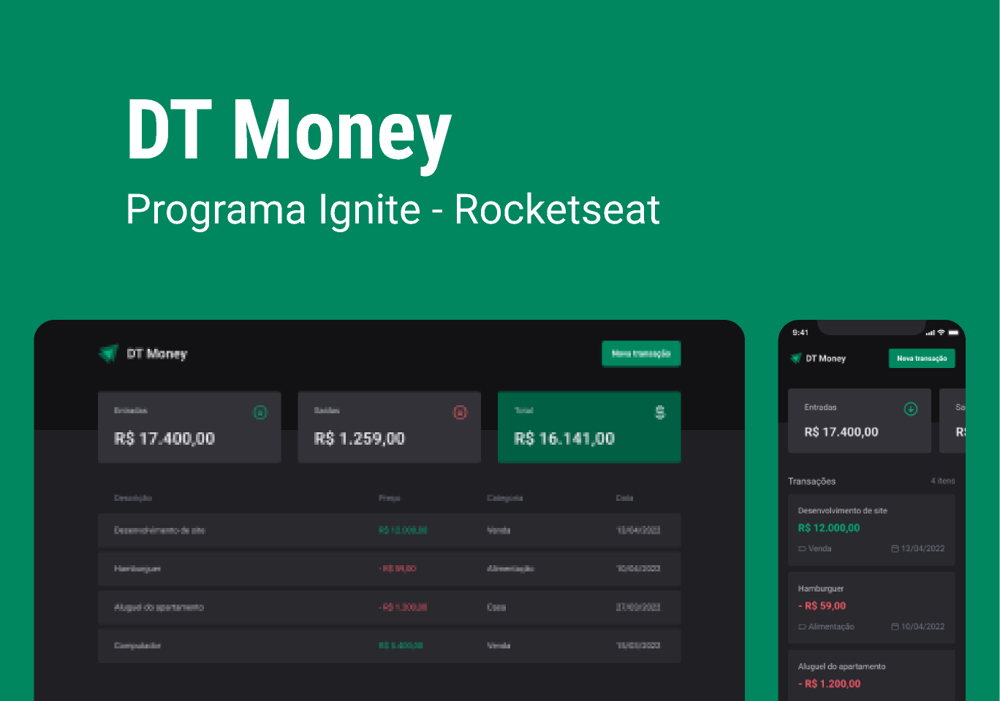

# Trilha Ignite - DT Money 📚

# DT Money 🏦

> ## Descrição 📝
O Ignite DT Money é um projeto desenvolvido pela Rocketseat, como parte da trilha de React do Ignite. Ele é um aplicativo projetado para facilitar o gerenciamento de despesas, receitas e débitos. Os usuários podem cadastrar novas entradas, sejam elas receitas ou débitos. Automaticamente, o sistema recalcula um resumo com o total de entradas, o total de saídas e o saldo geral. Além disso, apresenta uma lista detalhada desses gastos, incluindo informações como data de criação. O projeto foi construído utilizando React e aplicou os principais fundamentos da biblioteca, como useContext, useCallback, useMemo, entre outros.

obs: Devido ao uso do json-server, algumas funções não irão executar corretamente no link do deploy, para um teste real do app sugiro que faça um clone do repo, instale as dependências com seu gerenciador de pacotes, rode o servidor com o script 'dev:server', pegue a url local do json-server e coloque-a na baseURL do axios em src/lib/axios.ts, após isso, em outro terminal, rode o app com o script 'dev' e estará pronto para uso.

 
 

> ## Tecnologias 👨🏾‍💻
Foram utilizadas as seguintes tecnologias neste projeto:
+ React.Js + TypeScript :
  -  Lib Js para desenvolvimento de interfaces modernas baseadas em componentes.
+ Vite.Js:
  - Ambiente de desenvolvimento.
+ Styled Components:
  - Estilizador de componentes.
+ React Hook Form:
  - Lib de gerenciamento de formulários para React.
+ Intl:
  - Objeto global de internacionalização do JavaScript.
+ Axios:
  - Lib para de consumo de API's.
+ Radix UI:
  - Lib de componentes para o react.
+ Zod:
  - Lib de validação de formulários.
+ Phosphor React:
  - Lib de icons para React

 
 

> ## Printscreen do Projeto 📸

 
 

> ## Autor 📝
+ [Ruan Cardoso](https://www.linkedin.com/in/ruancardosolinkdin/)
